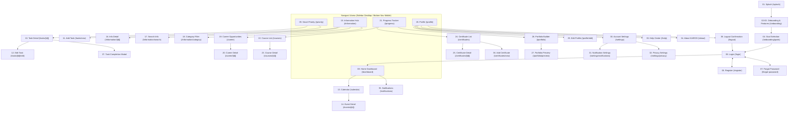

# KAIROS Navigation Map

```mermaid
flowchart TD
    Splash["01. Splash (/splash)"] --> Onboarding["02-03. Onboarding & Features (/onboarding)"]
    Onboarding --> Goals["04. Goal Selection (/onboarding/goals)"]
    Goals --> Login["05. Login (/login)"]
    Login <--> Register["06. Register (/register)"]
    Login <--> ForgotPass["07. Forgot Password (/forgot-password)"]
    
    Login --> Dashboard["08. Home Dashboard (/dashboard)"]
    
    subgraph MainNavigation ["Navigasi Utama (Sidebar Desktop / Bottom Nav Mobile)"]
        Dashboard
        Priority["09. Smart Priority (/priority)"]
        InfoHub["15. Information Hub (/information)"]
        Progress["21. Progress Tracker (/progress)"]
        Profile["28. Profile (/profile)"]
    end
    
    %% Priority branch
    Priority --> TaskDetail["10. Task Detail (/tasks/[id])"]
    Priority --> NewTask["11. Add Task (/tasks/new)"]
    TaskDetail --> EditTask["12. Edit Task (/tasks/[id]/edit)"]
    TaskDetail --> TaskConfirm["37. Task Completion Modal"]
    
    %% Calendar branch
    Dashboard --> Calendar["13. Calendar (/calendar)"]
    Calendar --> EventDetail["14. Event Detail (/events/[id])"]
    
    %% Information branch
    InfoHub --> InfoDetail["16. Info Detail (/information/[id])"]
    InfoHub --> InfoSearch["17. Search Info (/information/search)"]
    InfoHub --> CategoryFilter["18. Category Filter (/information/category)"]
    InfoHub --> Career["19. Career Opportunities (/career)"]
    Career --> CareerDetail["20. Career Detail (/career/[id])"]
    
    %% Progress branch
    Progress --> Courses["22. Course List (/courses)"]
    Courses --> CourseDetail["23. Course Detail (/courses/[id])"]
    Progress --> Certificates["24. Certificate List (/certificates)"]
    Certificates --> CertDetail["25. Certificate Detail (/certificates/[id])"]
    Certificates --> NewCert["36. Add Certificate (/certificates/new)"]
    Progress --> Portfolio["26. Portfolio Builder (/portfolio)"]
    Portfolio --> PortfolioPreview["27. Portfolio Preview (/portfolio/preview)"]
    
    %% Profile branch
    Profile --> EditProfile["29. Edit Profile (/profile/edit)"]
    Profile --> Settings["30. Account Settings (/settings)"]
    Settings --> NotifSettings["31. Notification Settings (/settings/notifications)"]
    Settings --> PrivacySettings["32. Privacy Settings (/settings/privacy)"]
    Profile --> Help["33. Help Center (/help)"]
    Profile --> About["34. About KAIROS (/about)"]
    Dashboard --> NotifCenter["35. Notifications (/notifications)"]
    Profile --> Logout["38. Logout Confirmation (/logout)"]
    Logout --> Login
```
